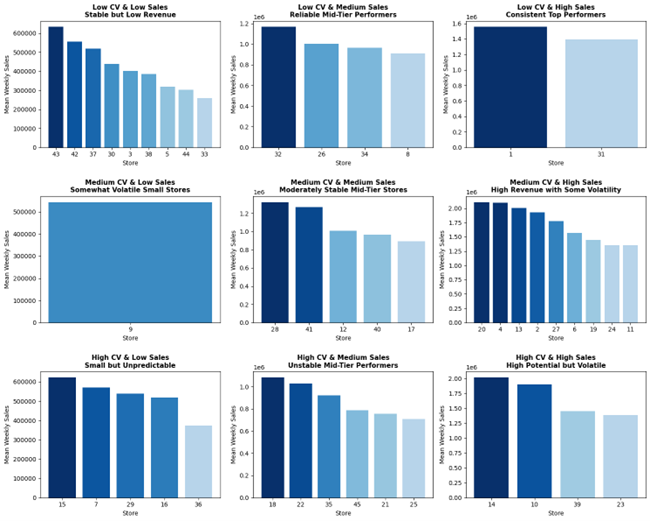
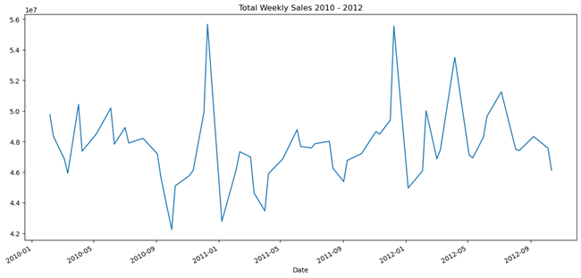
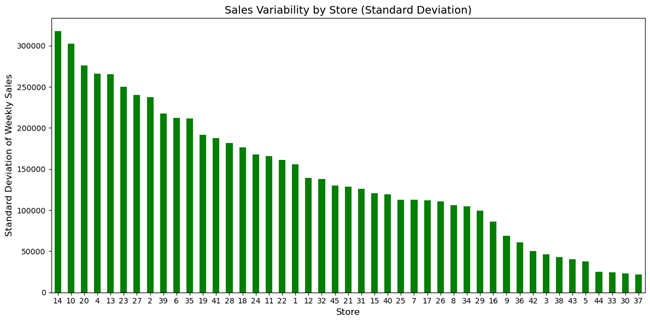
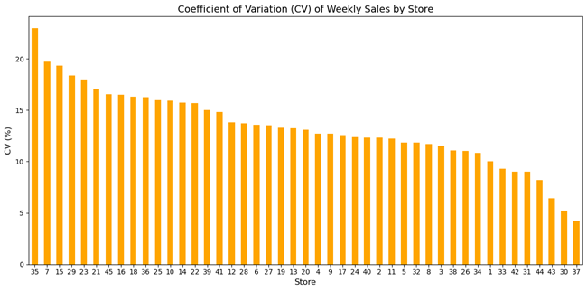
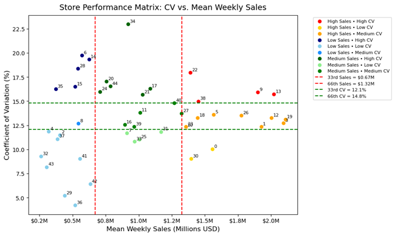

# Walmart Retail Sales 2010-2012

**Used Tools:** Python, Power BI  
**Project Type:** Data Cleaning, Exploratory Data Analysis, Data Visualization  

---

## Project Background
This project analyzes weekly sales data from 45 Walmart stores between February 2010 and November 2012. The objective is to assist senior management in extracting high-level breakdowns at the store level to better understand the sales variabilities. This will support further analysis and decision-making in inventory management, staffing, promotional strategies.

---

## Executive Summary
Overall, total sales across stores reached $6.74B between 2010 - 2012 with December exceeding $54M.  

Stores 1 and 31 ranked as top performers, each generating weekly mean sales of approximately $1.4M with a CV of around 9–10%. These stores represent operational benchmarks and should serve as models for future pilot programs.  

However, stores 7, 15, 16, 29, 36, 18, 21, 22, 25, 35, and 45, with weekly mean sales ranging from $374K to $1.08M and CVs between 15.7% and 23%, demonstrated high volatility despite moderate to high sales levels. This indicates a need for operational stabilization and improved planning to smooth the variability.  

In contrast, mid-tier but stable stores including 8, 12, 17, 26, 28, 32, 34, 40, and 41, with weekly mean sales between $894K and $1.32M and CVs of 10.8–13.8%, showed strong potential and can be targeted for marketing initiatives and product expansion to drive growth.  

---

## Data Source
The dataset was downloaded from Kaggle: [Walmart Dataset – Retail](https://www.kaggle.com/datasets/rutuspatel/walmart-dataset-retail).

---

## Data Cleaning & Preparation
- The Date column was converted to a consistent datetime format, with Year and Month fields added for trend analysis.  
- Numeric columns were validated with no missing values.  

---

## Methodology
Stores were segmented into Low, Medium, and High categories using the 33rd and 66th percentile cutoffs for standard deviation (STD) and Coefficient of Variation (CV) %. This relative method ensures classifications are based on how each Walmart store performs compared to its peers in the same dataset. For broader business context and reference, a CV% benchmark table is also provided below.  

---

## Coefficient of Variation (CV%) – Retail Sales Stability Benchmark for Reference

| CV% Range | Variability Level   | Business Interpretation                                                   | Common Actions                                         |
|-----------|---------------------|---------------------------------------------------------------------------|--------------------------------------------------------|
| < 10%     | Very Stable         | Predictable demand; ideal for long-term forecasting and steady inventory. | Maintain current operations; use as pilot locations.   |
| 10–20%    | Moderately Variable | Normal fluctuations from promotions, local events, or mild seasonality.   | Monitor closely; optimize promotions and inventory.    |
| > 20%     | Highly Variable     | Significant sales variations from strong seasonality or operational issues.| Improve demand forecasting; adjust staffing/inventory. |

---

## Core Analysis

### Total Weekly Sales Trend (2010–2012)
The overall weekly sales for all 45 Walmart stores fluctuated between approximately $42M and $56M over the three-year period. Clear recurring spikes occurred each December during the holiday shopping season, with weekly sales exceeding $54M, followed by sharp declines in early January. Sales otherwise remained within a relatively stable range. Lows were witnessed in October 2010 and January 2011 falling below $44M, and higher sales observed in April and July 2012, both exceeding $50M.  

---

### Sales Variability by Store (Standard Deviation)
Sales standard deviation (STD) varies significantly across stores. Store 14 exhibits the highest standard deviation (above $310K), followed closely by Stores 10 and 20. High variability stores can indicate susceptibility to seasonal swings, promotional impacts, or external factors. Conversely, Stores 37, 30, and 33 show minimal fluctuations, suggesting stable but potentially less dynamic sales environments.  

---

### Sales Stability: Coefficient of Variation (CV)
Most stores’ CV values indicate relative stability around 10-15%, though differences exist between the highest and lowest performers. Store 35 stands out with the highest CV (~23%), representing highly volatile sales relative to its average. On the opposite end, Stores 37, 30, and 44 have low CV values under 6%, suggesting predictable sales patterns and possible use for pilot locations.  

---

### Store Performance Matrix: Mean Weekly Sales vs. Sales Variability
This matrix scatters stores based on their mean weekly sales and coefficient of variation (CV), divided into 9 quadrants using 33rd and 66th percentile for both metrics.  

- **Bottom Left, Low CV & Low Sales:** 3, 5, 30, 33, 37, 38, 42, 43, 44  
- **Bottom Middle, Low CV & Medium Sales:** 8, 26, 32, 34  
- **Bottom Right, Low CV & High Sales:** 1, 31  
- **Middle Left, Medium CV & Low Sales:** 9  
- **Center, Medium CV & Medium Sales:** 12, 17, 28, 40, 41  
- **Middle Right, Medium CV & High Sales:** 2, 4, 6, 11, 13, 19, 20, 24, 27  
- **Top Left, High CV & Low Sales:** 7, 15, 16, 29, 36  
- **Top Middle, High CV & Medium Sales:** 18, 21, 22, 25, 35, 45  
- **Top Right, High CV & High Sales:** 10, 14, 23, 39  

---

### CV & Sales Category Matrix

| CV & Sales Category | Store Situation                 | Business Recommendation                         | Stores                       |
|---------------------|---------------------------------|------------------------------------------------|------------------------------|
| Low CV & Low Sales  | Stable but low revenue          | Explore targeted marketing or expand assortment | 3, 5, 30, 33, 37, 38, 42, 43, 44 |
| Low CV & Medium Sales | Reliable mid-tier performers | Maintain strategy; optimize gradually           | 8, 26, 32, 34 |
| Low CV & High Sales | Consistent top performers       | Pilot new initiatives and premium offerings     | 1, 31 |
| Medium CV & Low Sales | Some volatility, low revenue | Investigate causes; stabilize operations        | 9 |
| Medium CV & Medium Sales | Moderate stability, growth potential | Fine-tune promotions; incremental gains | 12, 17, 28, 40, 41 |
| Medium CV & High Sales | High revenue, variable       | Improve inventory planning; manage fluctuations | 2, 4, 6, 11, 13, 19, 20, 24, 27 |
| High CV & Low Sales | Unpredictable small-scale       | Stabilize before scaling operations             | 7, 15, 16, 29, 36 |
| High CV & Medium Sales | Unstable mid-tier            | Adjust stock levels and staffing strategies     | 18, 21, 22, 25, 35, 45 |
| High CV & High Sales | High potential, volatile       | Enhance forecasting and holiday planning        | 10, 14, 23, 39 |

---

## Recommendations
1. **Standardize top-performer playbook (Stores 1, 31):** Codify replenishment, labor, and promo SOPs; audit quarterly.  
2. **Stabilize high-sales/high-CV stores (10, 14, 23, 39):** Use service-level safety stock, enforce OTIF SLAs, and move to weekly, event-aware forecasts.  
3. **Grow stable but low-revenue stores (42, 43):** Localize assortment, optimize space/layout, and run targeted marketing to lift baseline sales.  
4. **Unlock mid-tier potential:** Invest in reliable mid-tier (8, 26, 32, 34) with product/pricing tests; tighten unstable mid-tier (18, 21, 25, 35, 41) via promo discipline and forecast granularity.  
5. **Plan for peaks:** Pre-build inventory and staffing for December; use weather/event overlays; pre-schedule post-peak markdowns and retention offers.  

---

## Limitations
- The dataset covers February 2010 to November 2012, which misses a few months for annual comparisons.  
- The segmentation approach used quantile thresholds for sales and CV, which work for relative comparison within this dataset but may require recalibration for other timeframes.  

---
